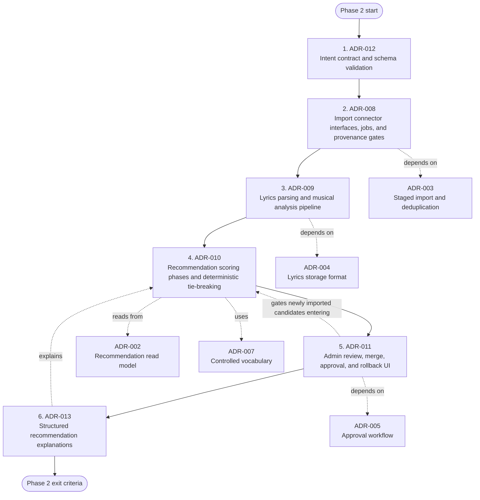

# Architecture Decision Records Index

This directory contains the Architecture Decision Records for Cadentia.

## ADR List

- [ADR-001: Song Data Infrastructure and Storage Architecture](./ADR-001-song-data-infrastructure.md)
- [ADR-002: Recommendation Candidate Read Model Design](./ADR-002-recommendation-read-model.md)
- [ADR-003: Song Import and Deduplication Workflow](./ADR-003-song-import-deduplication.md)
- [ADR-004: Lyrics Storage Format and Parsing Strategy](./ADR-004-lyrics-storage-format.md)
- [ADR-005: Approval and Doctrinal Review Workflow](./ADR-005-approval-doctrinal-review.md)
- [ADR-006: Arrangement Transposition Policy](./ADR-006-arrangement-transposition.md)
- [ADR-007: Tag Taxonomy and Controlled Vocabulary Strategy](./ADR-007-tag-taxonomy.md)
- [ADR-008: Song Acquisition and Import Connector Architecture](./ADR-008-song-acquisition-import-connector-architecture.md)
- [ADR-009: Lyrics Parsing and Musical Analysis Pipeline](./ADR-009-lyrics-parsing-musical-analysis-pipeline.md)
- [ADR-010: Recommendation Engine Scoring Architecture](./ADR-010-recommendation-engine-scoring-architecture.md)
- [ADR-011: Admin Review and Catalog Governance UI](./ADR-011-admin-review-catalog-governance-ui.md)
- [ADR-012: LLM Intent Extraction Contract](./ADR-012-llm-intent-extraction-contract.md)
- [ADR-013: Recommendation Explanation System](./ADR-013-recommendation-explanation-system.md)
- [ADR-014: LLM Intent Extraction Contract](./ADR-014-llm-intent-extraction-contract.md)
- [ADR-015: Guided Menu and Conversational Request Flow](./ADR-015-guided-menu-and-conversational-request-flow.md)
- [ADR-016: Setlist Persistence and Versioning](./ADR-016-setlist-persistence-and-versioning.md)
- [ADR-017: User Feedback and Recommendation Tuning](./ADR-017-user-feedback-and-recommendation-tuning.md)
- [ADR-018: Service Plan Integration Model](./ADR-018-service-plan-integration-model.md)
- [ADR-019: Security, Roles, and Permissions](./ADR-019-security-roles-and-permissions.md)
- [ADR-020: External Integration Boundaries](./ADR-020-external-integration-boundaries.md)
- [ADR-021: Recommendation Engine Explainability API](./ADR-021-recommendation-engine-explainability-api.md)
- [ADR-022: Packaged Deployment and Church Customization Model](./ADR-022-packaged-deployment-and-church-customization-model.md)
- [ADR-023: Team and Musician Assignment Model](./ADR-023-team-and-musician-assignment-model.md)
- [ADR-024: Rehearsal and Workflow Lifecycle](./ADR-024-rehearsal-and-workflow-lifecycle.md)
- [ADR-025: Media and Asset Management](./ADR-025-media-and-asset-management.md)
- [ADR-026: Search Architecture and Discovery](./ADR-026-search-architecture-and-discovery.md)
- [ADR-027: Caching and Performance Strategy](./ADR-027-caching-and-performance-strategy.md)
- [ADR-028: Eventing and Async Processing Architecture](./ADR-028-eventing-and-async-processing-architecture.md)
- [ADR-029: Observability and Telemetry Strategy](./ADR-029-observability-and-telemetry-strategy.md)
- [ADR-030: Plugin and Extension Architecture](./ADR-030-plugin-and-extension-architecture.md)
- [ADR-031: Musical Transition Analysis Engine](./ADR-031-musical-transition-analysis-engine.md)
- [ADR-032: Energy Arc Modeling](./ADR-032-energy-arc-modeling.md)
- [ADR-033: Arrangement Compatibility and Instrumentation Modeling](./ADR-033-arrangement-compatibility-and-instrumentation-modeling.md)
- [ADR-034: Congregational Familiarity Model](./ADR-034-congregational-familiarity-model.md)
- [ADR-035: Telegram Bot E2E Integration and Operations](./ADR-035-telegram-bot-e2e-integration-and-operations.md)
- [ADR-036: Administrative Web Interface](./ADR-036-administrative-web-interface.md)
- [ADR-037: Ollama LLM Integration](./ADR-037-ollama-llm-integration.md)

## Implemented schema artifacts

- ADR-001 is implemented by the Flyway migration
  `apps/api/src/main/resources/db/migration/V002__core_catalog_schema.sql`,
  which creates the canonical PostgreSQL source-of-truth catalog tables.
- The implemented ADR-001 ER diagram is maintained in `docs/diagrams/er-diagrams.md`.
- Test-only fixture loading and reset instructions are documented in
  `docs/seed-data.md`; these fixtures are not production catalog data and are
  not recommendable unless a test deliberately opts into that behavior.

## Reading order

Recommended reading order:

1. ADR-001 — core data infrastructure
2. ADR-002 — recommendation candidate read model
3. ADR-003 — import and deduplication workflow
4. ADR-004 — lyrics format and parsing strategy
5. ADR-005 — approval and doctrinal review
6. ADR-006 — arrangement transposition policy
7. ADR-007 — taxonomy and controlled vocabulary
8. ADR-008 — acquisition connectors and import lifecycle
9. ADR-009 — lyrics parsing and musical analysis
10. ADR-010 — recommendation scoring architecture
11. ADR-011 — admin review and catalog governance UI
12. ADR-012 — LLM intent extraction contract
13. ADR-013 — recommendation explanation system
14. ADR-014 — LLM intent extraction contract revision
15. ADR-015 — guided menu and conversational request flow
16. ADR-016 — setlist persistence and versioning
17. ADR-017 — user feedback and recommendation tuning
18. ADR-018 — service plan integration model
19. ADR-019 — security, roles, and permissions
20. ADR-020 — external integration boundaries duplicate/rejected decision
21. ADR-021 — recommendation explainability API
22. ADR-022 — packaged deployment and church customization model
23. ADR-023 — team and musician assignment model
24. ADR-024 — rehearsal and workflow lifecycle
25. ADR-025 — media and asset management
26. ADR-026 — search architecture and discovery
27. ADR-027 — caching and performance strategy
28. ADR-028 — eventing and async processing architecture
29. ADR-029 — observability and telemetry strategy
30. ADR-030 — plugin and extension architecture
31. ADR-031 — musical transition analysis engine
32. ADR-032 — energy arc modeling
33. ADR-033 — arrangement compatibility and instrumentation modeling
34. ADR-034 — congregational familiarity model
35. ADR-035 — Telegram bot E2E integration and operations
36. ADR-036 — administrative web interface
37. ADR-037 — Ollama LLM integration

## Phase 2 implementation order plan

The Phase 2 implementation order starts with the safety contracts and data flow
foundations, then layers import, parsing, deterministic recommendation,
governance UI, and explanation features on top. The only adjustment from the
initial proposal is to implement ADR-010 before the full ADR-011 UI: the scoring
core can be built and tested safely against already-approved read-model
candidates, while ADR-011 remains the mandatory gate before any newly imported
Phase 2 content can become recommendable.

Detailed task breakdowns live in
[`docs/implementation-plans`](../implementation-plans/README.md).

### Phase 2 milestones

1. **Intent boundary first:** implement ADR-012 schemas, validation, defaults,
   and retry/fallback behavior before exposing any recommendation endpoint to
   natural-language requests.
2. **Safe acquisition foundation:** implement ADR-008 connector abstractions,
   import batches, job states, provenance requirements, and policy-blocked
   connector behavior before adding provider-specific automation.
3. **Recalculable musical metadata:** implement ADR-009 parser outputs as
   versioned derived data so import review can display chord, section, key, BPM,
   and confidence evidence without overwriting raw source documents.
4. **Deterministic recommendation core:** implement ADR-010 scoring profiles,
   hard filters, transition scoring, energy arc evaluation, and stable
   tie-breaking only against already-approved read-model candidates.
5. **Governance before new-import eligibility:** implement ADR-011 review queues,
   merge decisions, approval actions, audit trails, and rollback before any Phase
   2 imported content can become recommendable.
6. **Explainability last:** implement ADR-013 explanation facts after scoring
   emits stable component scores and transition evidence, so user-facing
   explanations remain grounded in deterministic engine output.

## Phase 4 ADR direction

ADR-021 through ADR-037 extend the existing safety and recommendation foundation into operational maturity. They preserve Cadentia's core boundaries: the LLM interprets intent only, the deterministic Recommendation Engine selects and orders songs, recommendations use only curated and approved catalog data, and all eligibility remains approval-gated.

Phase 4 themes:

1. **Explainability and musical intelligence:** ADR-021, ADR-031, ADR-032, ADR-033, and ADR-034 define structured explanations, transition analysis, energy arcs, arrangement compatibility, and familiarity controls.
2. **Operational collaboration:** ADR-023, ADR-024, ADR-035, and ADR-036 model people, assignments, rehearsals, readiness, Telegram interactions, and administrative web workflows.
3. **Platform scale:** ADR-022, ADR-025, ADR-026, ADR-027, ADR-028, and ADR-029 define packaged isolated deployments, assets, search, caching, events, and telemetry.
4. **Extensibility:** ADR-030 defines plugin boundaries while keeping approval gates and deterministic recommendation guarantees centralized.

## Cross-cutting principles

Across all ADRs, Cadentia follows these rules:

- The LLM interprets intent only.
- The Recommendation Engine selects songs deterministically.
- Only curated catalog entries may be recommended.
- Approval state must gate recommendation eligibility.
- Musical metadata must support explainable set construction.
