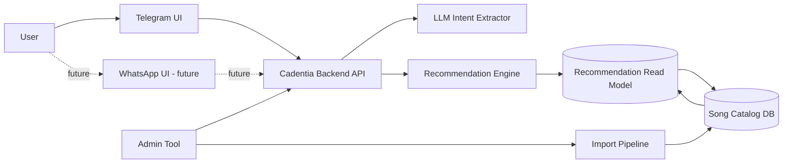
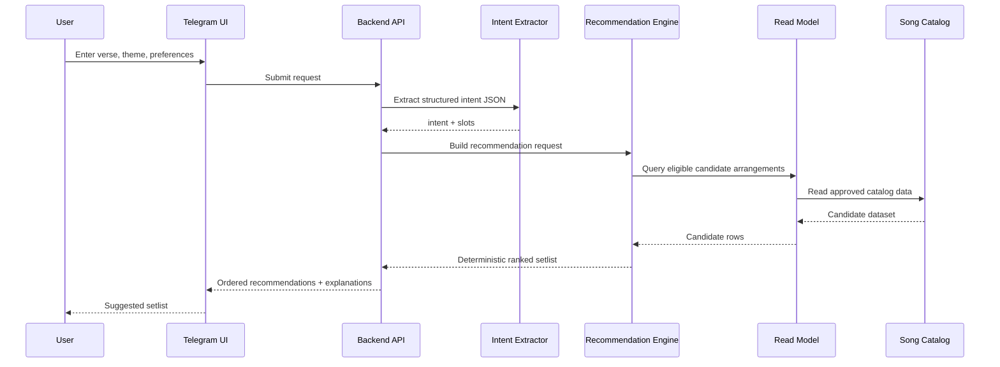
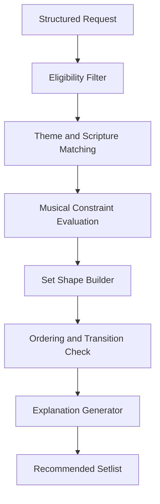
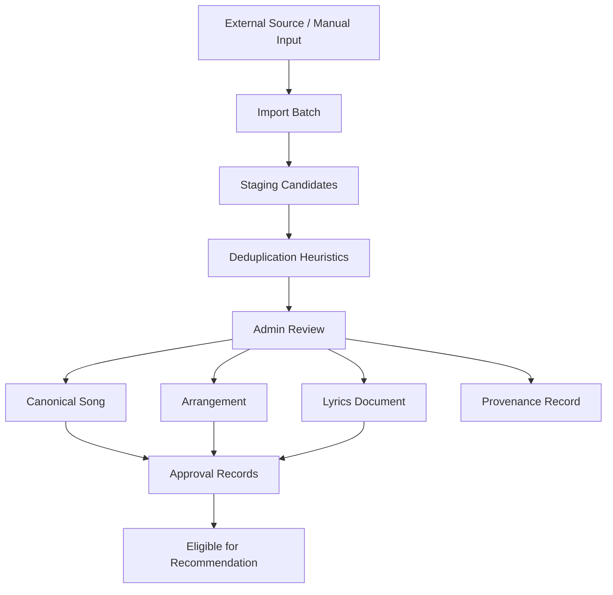
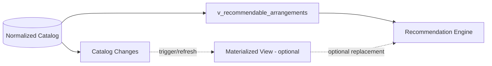
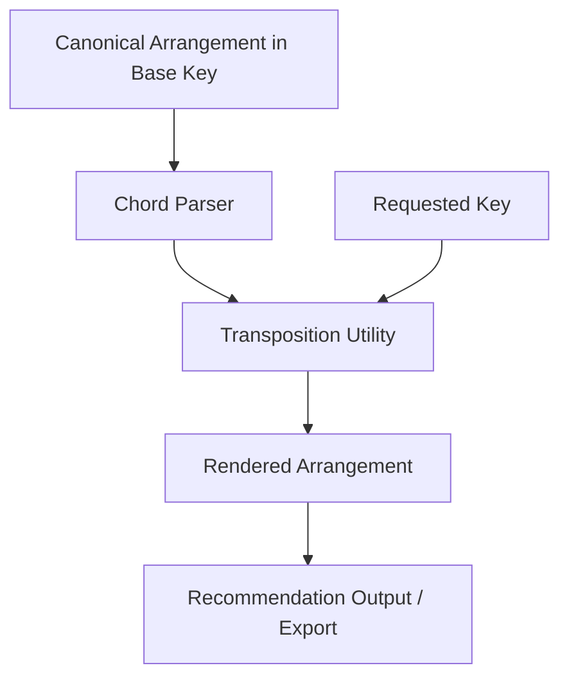

# Mermaid Architecture Diagrams

## 1. High-Level System Architecture

## 2. Setlist Request Flow

## 3. Recommendation Engine Internal Flow

## 4. Import and Approval Architecture

## 5. Read Model Refresh Architecture

## 6. Transposition Handling Flow

