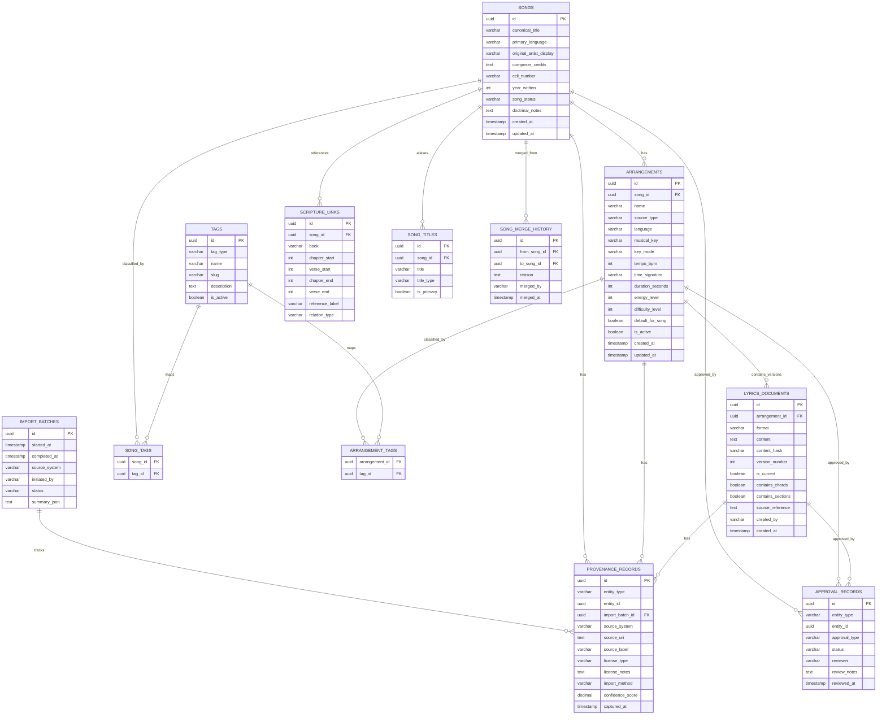
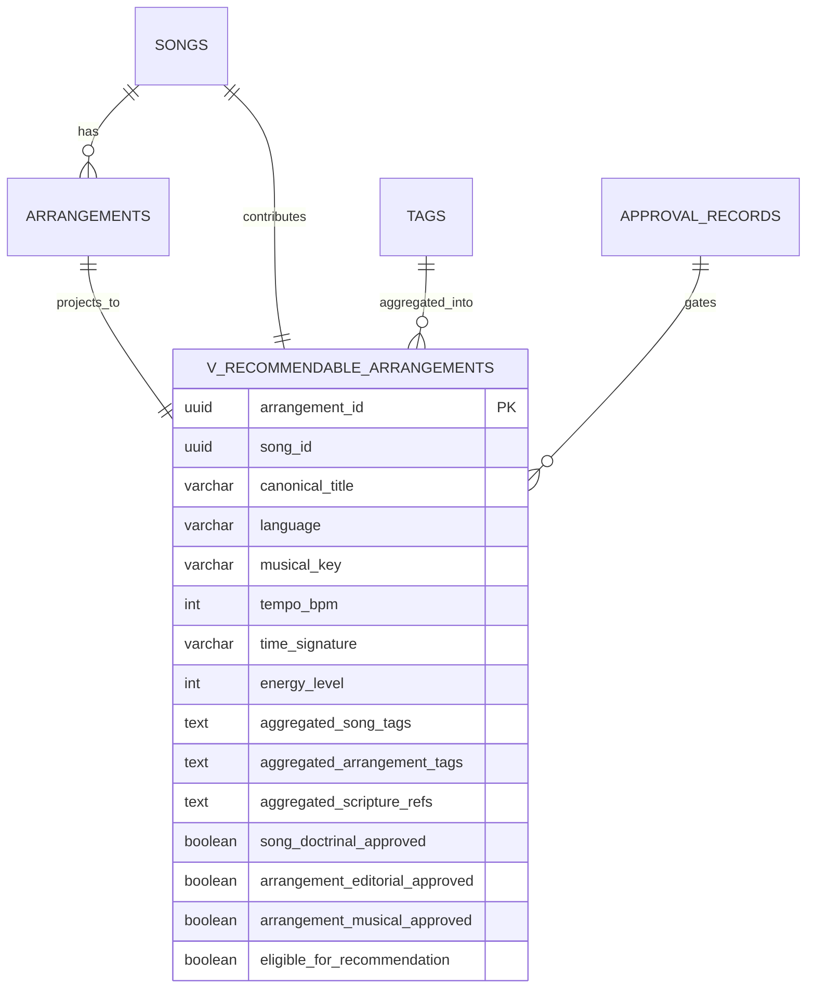
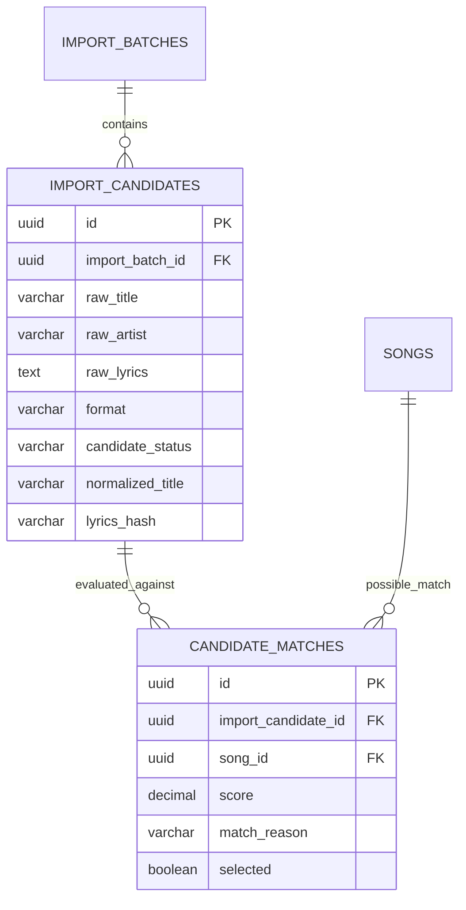

# Mermaid ER Diagrams

## 1. Core Song Catalog ER Diagram

```mermaid
erDiagram
    SONGS ||--o{ ARRANGEMENTS : has
    ARRANGEMENTS ||--o{ LYRICS_DOCUMENTS : contains_versions
    SONGS ||--o{ SONG_TAGS : classified_by
    TAGS ||--o{ SONG_TAGS : maps
    ARRANGEMENTS ||--o{ ARRANGEMENT_TAGS : classified_by
    TAGS ||--o{ ARRANGEMENT_TAGS : maps
    SONGS ||--o{ SCRIPTURE_LINKS : references
    SONGS ||--o{ SONG_TITLES : aliases
    SONGS ||--o{ SONG_MERGE_HISTORY : merged_from
    IMPORT_BATCHES ||--o{ PROVENANCE_RECORDS : tracks
    SONGS ||--o{ PROVENANCE_RECORDS : has
    ARRANGEMENTS ||--o{ PROVENANCE_RECORDS : has
    LYRICS_DOCUMENTS ||--o{ PROVENANCE_RECORDS : has
    SONGS ||--o{ APPROVAL_RECORDS : approved_by
    ARRANGEMENTS ||--o{ APPROVAL_RECORDS : approved_by
    LYRICS_DOCUMENTS ||--o{ APPROVAL_RECORDS : approved_by

    SONGS {
        uuid id PK
        varchar canonical_title
        varchar primary_language
        varchar original_artist_display
        text composer_credits
        varchar ccli_number
        int year_written
        varchar song_status
        text doctrinal_notes
        timestamp created_at
        timestamp updated_at
    }

    SONG_TITLES {
        uuid id PK
        uuid song_id FK
        varchar title
        varchar title_type
        boolean is_primary
    }

    ARRANGEMENTS {
        uuid id PK
        uuid song_id FK
        varchar name
        varchar source_type
        varchar language
        varchar musical_key
        varchar key_mode
        int tempo_bpm
        varchar time_signature
        int duration_seconds
        int energy_level
        int difficulty_level
        boolean default_for_song
        boolean is_active
        timestamp created_at
        timestamp updated_at
    }

    LYRICS_DOCUMENTS {
        uuid id PK
        uuid arrangement_id FK
        varchar format
        text content
        varchar content_hash
        int version_number
        boolean is_current
        boolean contains_chords
        boolean contains_sections
        text source_reference
        varchar created_by
        timestamp created_at
    }

    TAGS {
        uuid id PK
        varchar tag_type
        varchar name
        varchar slug
        text description
        boolean is_active
    }

    SONG_TAGS {
        uuid song_id FK
        uuid tag_id FK
    }

    ARRANGEMENT_TAGS {
        uuid arrangement_id FK
        uuid tag_id FK
    }

    SCRIPTURE_LINKS {
        uuid id PK
        uuid song_id FK
        varchar book
        int chapter_start
        int verse_start
        int chapter_end
        int verse_end
        varchar reference_label
        varchar relation_type
    }

    PROVENANCE_RECORDS {
        uuid id PK
        varchar entity_type
        uuid entity_id
        uuid import_batch_id FK
        varchar source_system
        text source_uri
        varchar source_label
        varchar license_type
        text license_notes
        varchar import_method
        decimal confidence_score
        timestamp captured_at
    }

    APPROVAL_RECORDS {
        uuid id PK
        varchar entity_type
        uuid entity_id
        varchar approval_type
        varchar status
        varchar reviewer
        text review_notes
        timestamp reviewed_at
    }

    IMPORT_BATCHES {
        uuid id PK
        timestamp started_at
        timestamp completed_at
        varchar source_system
        varchar initiated_by
        varchar status
        text summary_json
    }

    SONG_MERGE_HISTORY {
        uuid id PK
        uuid from_song_id FK
        uuid to_song_id FK
        text reason
        varchar merged_by
        timestamp merged_at
    }
```

## 2. Recommendation Read Model ER Diagram

```mermaid
erDiagram
    SONGS ||--o{ ARRANGEMENTS : has
    ARRANGEMENTS ||--|| V_RECOMMENDABLE_ARRANGEMENTS : projects_to
    SONGS ||--|| V_RECOMMENDABLE_ARRANGEMENTS : contributes
    TAGS ||--o{ V_RECOMMENDABLE_ARRANGEMENTS : aggregated_into
    APPROVAL_RECORDS ||--o{ V_RECOMMENDABLE_ARRANGEMENTS : gates

    V_RECOMMENDABLE_ARRANGEMENTS {
        uuid arrangement_id PK
        uuid song_id
        varchar canonical_title
        varchar language
        varchar musical_key
        int tempo_bpm
        varchar time_signature
        int energy_level
        text aggregated_song_tags
        text aggregated_arrangement_tags
        text aggregated_scripture_refs
        boolean song_doctrinal_approved
        boolean arrangement_editorial_approved
        boolean arrangement_musical_approved
        boolean eligible_for_recommendation
    }
```

## 3. Import Staging ER Diagram

```mermaid
erDiagram
    IMPORT_BATCHES ||--o{ IMPORT_CANDIDATES : contains
    IMPORT_CANDIDATES ||--o{ CANDIDATE_MATCHES : evaluated_against
    SONGS ||--o{ CANDIDATE_MATCHES : possible_match

    IMPORT_CANDIDATES {
        uuid id PK
        uuid import_batch_id FK
        varchar raw_title
        varchar raw_artist
        text raw_lyrics
        varchar format
        varchar candidate_status
        varchar normalized_title
        varchar lyrics_hash
    }

    CANDIDATE_MATCHES {
        uuid id PK
        uuid import_candidate_id FK
        uuid song_id FK
        decimal score
        varchar match_reason
        boolean selected
    }
```
