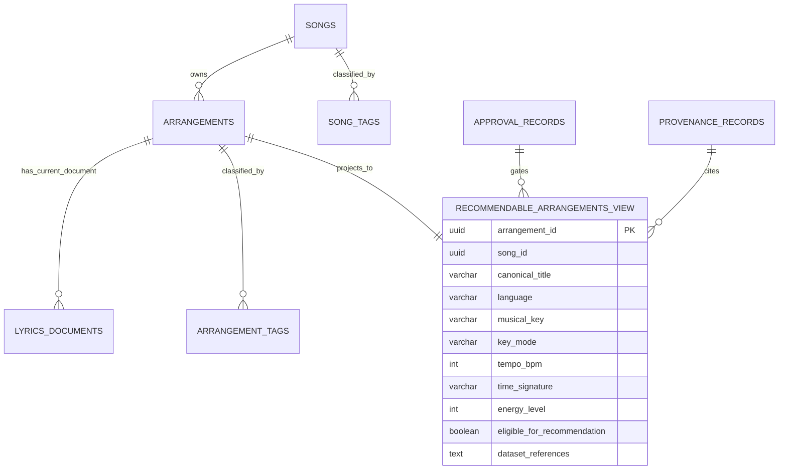
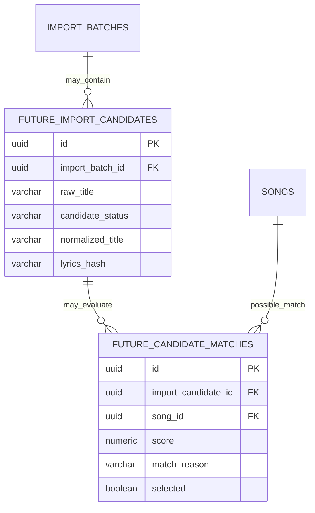

# Mermaid ER Diagrams

## 1. ADR-001 Core Catalog Source-of-Truth ER Diagram

This diagram reflects the PostgreSQL tables implemented by
`apps/api/src/main/resources/db/migration/V002__core_catalog_schema.sql`. It is
limited to source-of-truth catalog tables; recommendation read models, import
staging candidates, and vector-enrichment tables are not part of ADR-001.

```mermaid
erDiagram
    SONGS ||--o{ ARRANGEMENTS : owns
    ARRANGEMENTS ||--o{ LYRICS_DOCUMENTS : versions
    SONGS ||--o{ SONG_TAGS : classified_by
    TAGS ||--o{ SONG_TAGS : assigned_to_songs
    ARRANGEMENTS ||--o{ ARRANGEMENT_TAGS : classified_by
    TAGS ||--o{ ARRANGEMENT_TAGS : assigned_to_arrangements
    IMPORT_BATCHES ||--o{ PROVENANCE_RECORDS : captures
    SONGS ||--o{ PROVENANCE_RECORDS : evidenced_by
    ARRANGEMENTS ||--o{ PROVENANCE_RECORDS : evidenced_by
    LYRICS_DOCUMENTS ||--o{ PROVENANCE_RECORDS : evidenced_by
    SONGS ||--o{ APPROVAL_RECORDS : reviewed_by
    ARRANGEMENTS ||--o{ APPROVAL_RECORDS : reviewed_by
    LYRICS_DOCUMENTS ||--o{ APPROVAL_RECORDS : reviewed_by

    SONGS {
        uuid id PK
        varchar canonical_title
        varchar normalized_title UK
        varchar primary_language UK
        varchar original_artist_display
        text composer_credits
        varchar ccli_number UK
        int year_written
        varchar song_status
        text doctrinal_notes
        timestamptz created_at
        timestamptz updated_at
    }

    ARRANGEMENTS {
        uuid id PK
        uuid song_id FK
        varchar name
        varchar normalized_name UK
        varchar source_type
        varchar language UK
        varchar musical_key
        varchar key_mode
        int tempo_bpm
        varchar time_signature
        int duration_seconds
        int energy_level
        int difficulty_level
        boolean default_for_song
        boolean is_active
        timestamptz created_at
        timestamptz updated_at
    }

    LYRICS_DOCUMENTS {
        uuid id PK
        uuid arrangement_id FK
        varchar format
        text content
        varchar content_hash UK
        int version_number UK
        boolean is_current
        boolean contains_chords
        boolean contains_sections
        text source_reference
        varchar created_by
        timestamptz created_at
    }

    TAGS {
        uuid id PK
        varchar tag_type UK
        varchar name
        varchar slug UK
        text description
        int sort_order
        boolean is_active
        timestamptz created_at
        timestamptz updated_at
    }

    TAG_ALIASES {
        uuid id PK
        varchar tag_type UK
        uuid tag_id FK
        varchar alias_name
        varchar alias_slug UK
        timestamptz created_at
    }

    SONG_TAGS {
        uuid song_id PK,FK
        uuid tag_id PK,FK
        timestamptz created_at
    }

    ARRANGEMENT_TAGS {
        uuid arrangement_id PK,FK
        uuid tag_id PK,FK
        timestamptz created_at
    }

    LYRICS_DOCUMENT_TAGS {
        uuid lyrics_document_id PK,FK
        uuid tag_id PK,FK
        timestamptz created_at
    }

    IMPORT_BATCHES {
        uuid id PK
        varchar source_system
        varchar initiated_by
        varchar status
        jsonb summary_json
        timestamptz started_at
        timestamptz completed_at
    }

    PROVENANCE_RECORDS {
        uuid id PK
        uuid song_id FK
        uuid arrangement_id FK
        uuid lyrics_document_id FK
        uuid import_batch_id FK
        varchar source_system
        text source_uri
        varchar source_label
        varchar license_type
        text license_notes
        varchar import_method
        numeric confidence_score
        timestamptz captured_at
    }

    APPROVAL_RECORDS {
        uuid id PK
        uuid song_id FK
        uuid arrangement_id FK
        uuid lyrics_document_id FK
        varchar approval_type
        varchar status
        varchar reviewer
        text review_notes
        timestamptz reviewed_at
        timestamptz created_at
    }
```

### Relationship notes

- `arrangements.song_id` is required; every arrangement belongs to one
  canonical song.
- `lyrics_documents.arrangement_id` is required; ADR-001 stores lyrics versions
  at the arrangement level.
- `tag_aliases` stores controlled alternate names for existing canonical tags;
  aliases do not create canonical vocabulary automatically.
- `song_tags`, `arrangement_tags`, and `lyrics_document_tags` assign controlled
  `tags` values through composite primary keys and foreign keys that prevent
  orphaned assignments.
- `provenance_records` must reference exactly one of `song_id`,
  `arrangement_id`, or `lyrics_document_id`, and must reference an
  `import_batches` row.
- `approval_records` must reference exactly one of `song_id`, `arrangement_id`,
  or `lyrics_document_id`.
- Partial unique indexes enforce one default arrangement per song and one
  current lyrics document per arrangement.

## 2. Future ADR-002 Recommendation Read Model Boundary

ADR-002 may introduce a derived recommendation candidate read model over the
ADR-001 catalog tables. The read model is not part of the source-of-truth schema
and must not let the LLM create or select songs.

## 3. Future ADR-003 Import Staging Boundary

ADR-001 implements only `import_batches` and `provenance_records`. Candidate
staging, match review, and deduplication tables belong to ADR-003 and should be
documented as implemented only after a migration adds them.

