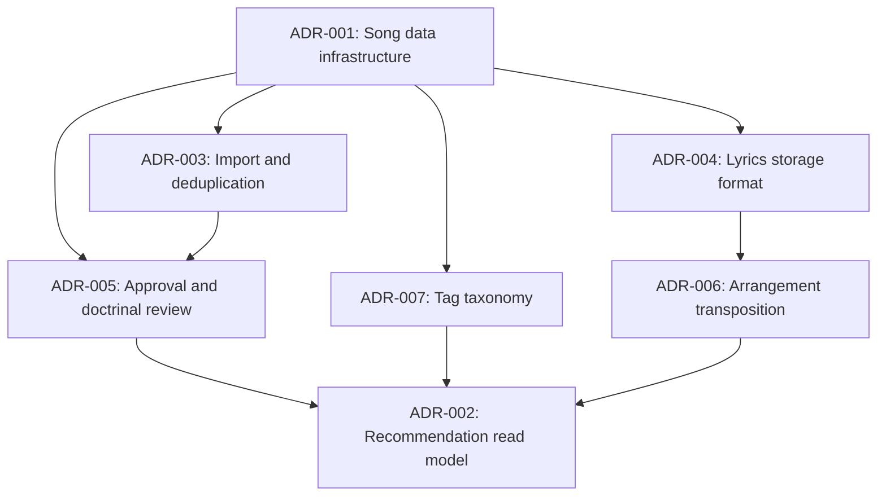
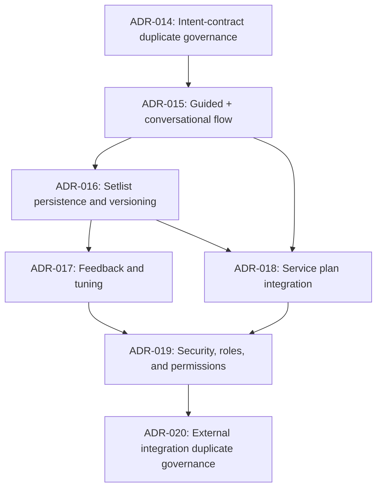

# Implementation Plans Index

This directory contains implementation plans for Cadentia Architecture Decision
Records (ADRs).

Each plan is written as a sequence of AI-agent-ready subtasks. Every subtask
includes:

- Context
- Prompt
- Acceptance criteria
- Restrictions

## Plan list

### Foundation plans

- [ADR-001 Implementation Plan: Song Data Infrastructure and Storage Architecture](./ADR-001-song-data-infrastructure-plan.md)
- [ADR-002 Implementation Plan: Recommendation Candidate Read Model Design](./ADR-002-recommendation-read-model-plan.md)
- [ADR-003 Implementation Plan: Song Import and Deduplication Workflow](./ADR-003-song-import-deduplication-plan.md)
- [ADR-004 Implementation Plan: Lyrics Storage Format and Parsing Strategy](./ADR-004-lyrics-storage-format-plan.md)
- [ADR-005 Implementation Plan: Approval and Doctrinal Review Workflow](./ADR-005-approval-doctrinal-review-plan.md)
- [ADR-006 Implementation Plan: Arrangement Transposition Policy](./ADR-006-arrangement-transposition-plan.md)
- [ADR-007 Implementation Plan: Tag Taxonomy and Controlled Vocabulary Strategy](./ADR-007-tag-taxonomy-plan.md)

### Phase 2 plans

- [ADR-012 Implementation Plan: LLM Intent Extraction Contract](./ADR-012-llm-intent-extraction-contract-plan.md)
- [ADR-008 Implementation Plan: Song Acquisition and Import Connector Architecture](./ADR-008-song-acquisition-import-connector-architecture-plan.md)
- [ADR-009 Implementation Plan: Lyrics Parsing and Musical Analysis Pipeline](./ADR-009-lyrics-parsing-musical-analysis-pipeline-plan.md)
- [ADR-010 Implementation Plan: Recommendation Engine Scoring Architecture](./ADR-010-recommendation-engine-scoring-architecture-plan.md)
- [ADR-011 Implementation Plan: Admin Review and Catalog Governance UI](./ADR-011-admin-review-catalog-governance-ui-plan.md)
- [ADR-013 Implementation Plan: Recommendation Explanation System](./ADR-013-recommendation-explanation-system-plan.md)

### Phase 3 plans

- [ADR-014 Implementation Plan: Duplicate Governance for Intent Contract](./ADR-014-llm-intent-extraction-contract-plan.md)
- [ADR-015 Implementation Plan: Guided Menu and Conversational Request Flow](./ADR-015-guided-menu-and-conversational-request-flow-plan.md)
- [ADR-016 Implementation Plan: Setlist Persistence and Versioning](./ADR-016-setlist-persistence-and-versioning-plan.md)
- [ADR-017 Implementation Plan: User Feedback and Recommendation Tuning](./ADR-017-user-feedback-and-recommendation-tuning-plan.md)
- [ADR-018 Implementation Plan: Service Plan Integration Model](./ADR-018-service-plan-integration-model-plan.md)
- [ADR-019 Implementation Plan: Security, Roles, and Permissions](./ADR-019-security-roles-and-permissions-plan.md)
- [ADR-020 Implementation Plan: Duplicate Governance for External Integrations](./ADR-020-external-integration-boundaries-plan.md)

### Phase 4 plans

- [ADR-021 Implementation Plan: Recommendation Engine Explainability API](./ADR-021-recommendation-engine-explainability-api-plan.md)
- [ADR-022 Implementation Plan: Packaged Deployment and Church Customization Model](./ADR-022-packaged-deployment-and-church-customization-model-plan.md)
- [ADR-023 Implementation Plan: Team and Musician Assignment Model](./ADR-023-team-and-musician-assignment-model-plan.md) — completed 2026-06-05
- [ADR-024 Implementation Plan: Rehearsal and Workflow Lifecycle](./ADR-024-rehearsal-and-workflow-lifecycle-plan.md)
- [ADR-025 Implementation Plan: Media and Asset Management](./ADR-025-media-and-asset-management-plan.md)
- [ADR-026 Implementation Plan: Search Architecture and Discovery](./ADR-026-search-architecture-and-discovery-plan.md)
- [ADR-027 Implementation Plan: Caching and Performance Strategy](./ADR-027-caching-and-performance-strategy-plan.md)
- [ADR-028 Implementation Plan: Eventing and Async Processing Architecture](./ADR-028-eventing-and-async-processing-architecture-plan.md)
- [ADR-029 Implementation Plan: Observability and Telemetry Strategy](./ADR-029-observability-and-telemetry-strategy-plan.md)
- [ADR-030 Implementation Plan: Plugin and Extension Architecture](./ADR-030-plugin-and-extension-architecture-plan.md)
- [ADR-031 Implementation Plan: Musical Transition Analysis Engine](./ADR-031-musical-transition-analysis-engine-plan.md)

## Operational workflow docs

- [Song Import and Deduplication Workflow](../import-workflow.md) documents the
  ADR-003 staged import lifecycle, statuses, reviewer responsibilities,
  deterministic deduplication signals, merge behavior, failure handling, and
  fixture-driven verification commands.
- [Safe Lyrics Handling](../lyrics-handling.md) documents ADR-004 raw-versus-derived
  lyrics storage, format validation, versioning and provenance expectations,
  deterministic parser boundaries, and copyright-safe fixture rules.
- [Approval Operations and Audit Expectations](../approval-operations.md) documents
  ADR-005 approval types, statuses, audit metadata, transition rules,
  recommendation gating, and LLM safety boundaries.
- [Tag Taxonomy Governance](../tag-taxonomy-governance.md) documents
  ADR-007 tag types, controlled-vocabulary lifecycle, assignment rules,
  admin workflows, import handling, recommendation/reporting usage, and
  LLM boundaries.
- [ADR-016 Setlist Versioning Operations Runbook](../runbooks/adr-016-setlist-versioning-operations.md) documents
  observability metrics, structured audit logging expectations, retention/archival
  defaults, conflict retry handling, partial-commit recovery, and restoration
  drill procedures.
- [Recommendation Explainability API Usage and Operations](../recommendation-explainability-api.md) documents
  ADR-021 payload examples, audience-mode behavior, reason-code registry
  ownership, localization workflow, schema migrations, redaction guarantees,
  and troubleshooting safeguards.
- [ADR-035 Telegram Bot Operations Runbook](../runbooks/adr-035-telegram-bot-operations.md) documents
  webhook setup, smoke testing, channel telemetry, retry/dead-letter triage,
  credential rotation, and safe channel disablement.
- [ADR-036 Administrative Web Interface Operations Runbook](../runbooks/adr-036-admin-interface-operations.md) documents
  admin UI deployment checks, role-access smoke tests, frontend/API contract
  mismatch triage, high-risk action monitoring, and UI rollback procedures.
- [ADR-022 Isolated Instance Provisioning Runbook](../runbooks/adr-022-isolated-instance-provisioning.md) documents
  provisioning, upgrade, backup, restore, export, staging clone, operator audit,
  and guardrail workflows for isolated church deployments.

- [ADR-022 Package Governance, Promotion, and Contributor Runbook](../runbooks/adr-022-package-governance.md) documents
  package authoring, validation, promotion, seed catalog governance, accepted
  `instanceId` usage, and contributor rules that prohibit shared tenant-filtered
  recommendation eligibility.
- [ADR-023 Team Assignment Operations Runbook](../runbooks/adr-023-team-assignment-operations.md) documents
  roster setup, controlled-vocabulary maintenance, availability collection,
  service/rehearsal assignments, substitutions, team-aware recommendation
  profiles, diagnostics, readiness boundaries, privacy rules, and troubleshooting.

## Recommended foundation implementation order

The foundation plans should generally be implemented from the source-of-truth
catalog outward. ADR-001 establishes the normalized data foundation, while
ADR-002, ADR-003, ADR-004, ADR-005, ADR-006, and ADR-007 can then build on that
foundation with the dependency order shown below.

## Recommended Phase 2 implementation order

1. [ADR-012: LLM Intent Extraction Contract](./ADR-012-llm-intent-extraction-contract-plan.md)
2. [ADR-008: Song Acquisition and Import Connector Architecture](./ADR-008-song-acquisition-import-connector-architecture-plan.md)
3. [ADR-009: Lyrics Parsing and Musical Analysis Pipeline](./ADR-009-lyrics-parsing-musical-analysis-pipeline-plan.md)
4. [ADR-010: Recommendation Engine Scoring Architecture](./ADR-010-recommendation-engine-scoring-architecture-plan.md)
5. [ADR-011: Admin Review and Catalog Governance UI](./ADR-011-admin-review-catalog-governance-ui-plan.md)
6. [ADR-013: Recommendation Explanation System](./ADR-013-recommendation-explanation-system-plan.md)

ADR-010 is intentionally placed before the full ADR-011 governance UI because the
deterministic scoring core can be built and tested against already-approved
read-model data without making newly imported content recommendable. ADR-011
still remains the mandatory gate before Phase 2 imported content can become
eligible for recommendation.

## Recommended Phase 3 implementation order

1. [ADR-014: Duplicate Governance for Intent Contract](./ADR-014-llm-intent-extraction-contract-plan.md)
2. [ADR-015: Guided Menu and Conversational Request Flow](./ADR-015-guided-menu-and-conversational-request-flow-plan.md)
3. [ADR-016: Setlist Persistence and Versioning](./ADR-016-setlist-persistence-and-versioning-plan.md)
4. [ADR-017: User Feedback and Recommendation Tuning](./ADR-017-user-feedback-and-recommendation-tuning-plan.md)
5. [ADR-018: Service Plan Integration Model](./ADR-018-service-plan-integration-model-plan.md)
6. [ADR-019: Security, Roles, and Permissions](./ADR-019-security-roles-and-permissions-plan.md)
7. [ADR-020: Duplicate Governance for External Integrations](./ADR-020-external-integration-boundaries-plan.md)

Phase 3 starts with duplicate-governance cleanup (ADR-014) so teams do not
implement against a rejected intent contract source. The conversational
orchestration flow (ADR-015) and immutable setlist versioning model (ADR-016)
establish the planning lifecycle required for feedback capture (ADR-017),
service-plan composition (ADR-018), and role-based enforcement (ADR-019).
ADR-020 is then applied as governance hardening to ensure external integration
work is consistently routed to canonical ADRs (ADR-008/003/011/004) rather than
duplicate directives.

## Recommended Phase 4 implementation order

1. [ADR-021: Recommendation Engine Explainability API](./ADR-021-recommendation-engine-explainability-api-plan.md)
   - Usage, migration, localization, and operations guide:
     [Recommendation Explainability API Usage and Operations](../recommendation-explainability-api.md)
2. [ADR-022: Packaged Deployment and Church Customization Model](./ADR-022-packaged-deployment-and-church-customization-model-plan.md)
   - Provisioning and lifecycle operations runbook:
     [ADR-022 Isolated Instance Provisioning Runbook](../runbooks/adr-022-isolated-instance-provisioning.md)
   - Package authoring, promotion, seed governance, and contributor guardrails:
     [ADR-022 Package Governance, Promotion, and Contributor Runbook](../runbooks/adr-022-package-governance.md)
3. [ADR-023: Team and Musician Assignment Model](./ADR-023-team-and-musician-assignment-model-plan.md) — completed 2026-06-05
4. [ADR-024: Rehearsal and Workflow Lifecycle](./ADR-024-rehearsal-and-workflow-lifecycle-plan.md) — reporting, observability, retention, and runbook coverage added for readiness blockers and completed-service history.
5. [ADR-025: Media and Asset Management](./ADR-025-media-and-asset-management-plan.md)
6. [ADR-026: Search Architecture and Discovery](./ADR-026-search-architecture-and-discovery-plan.md)
7. [ADR-027: Caching and Performance Strategy](./ADR-027-caching-and-performance-strategy-plan.md)
8. [ADR-028: Eventing and Async Processing Architecture](./ADR-028-eventing-and-async-processing-architecture-plan.md)
9. [ADR-029: Observability and Telemetry Strategy](./ADR-029-observability-and-telemetry-strategy-plan.md)

Phase 4 starts by making ADR-010 scoring facts and ADR-013 explanation facts
available through a stable, audience-partitioned API contract. ADR-022 then
hardens instance packaging and local customization boundaries before ADR-023
adds private, instance-scoped personnel and team-capability data that feeds
service planning and deterministic recommendation constraints. ADR-024 through
ADR-027 add workflow, media, search, and caching capabilities whose derived side
effects are made explicit and recoverable by ADR-028 eventing. This preserves
the deterministic Recommendation Engine boundary while allowing web clients,
audit views, localization layers, and background processors to render and update
structured facts rather than generated prose. ADR-029 then standardizes
privacy-aware observability across the preceding synchronous and asynchronous
workflows so release readiness can be verified through correlated logs, metrics,
traces, and audit records without leaking sensitive church-instance data.

## Cross-plan guardrails

- Do not let an LLM select songs or create recommendation results.
- Keep recommendation selection deterministic and backend-owned.
- Require approved catalog data before any song or arrangement becomes recommendable.
- Preserve provenance and auditability for imported or edited content.
- Prefer normalized source-of-truth data plus explicit read models for retrieval.
