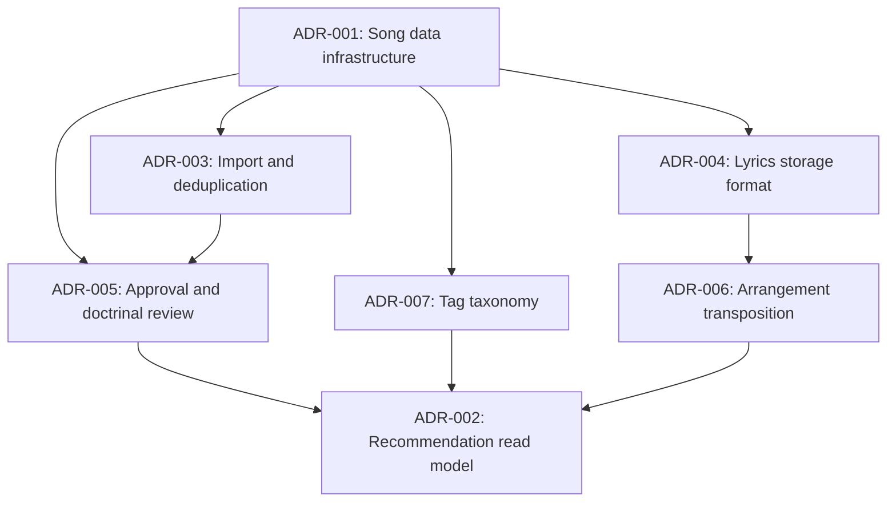

# Implementation Plans Index

This directory contains implementation plans for Cadentia Architecture Decision Records (ADRs).

Each plan is written as a sequence of AI-agent-ready subtasks. Every subtask includes:

- Context
- Prompt
- Acceptance criteria
- Restrictions

## Plan List

- [ADR-001 Implementation Plan: Song Data Infrastructure and Storage Architecture](./ADR-001-song-data-infrastructure-plan.md)
- [ADR-002 Implementation Plan: Recommendation Candidate Read Model Design](./ADR-002-recommendation-read-model-plan.md)
- [ADR-003 Implementation Plan: Song Import and Deduplication Workflow](./ADR-003-song-import-deduplication-plan.md)
- [ADR-004 Implementation Plan: Lyrics Storage Format and Parsing Strategy](./ADR-004-lyrics-storage-format-plan.md)
- [ADR-005 Implementation Plan: Approval and Doctrinal Review Workflow](./ADR-005-approval-doctrinal-review-plan.md)
- [ADR-006 Implementation Plan: Arrangement Transposition Policy](./ADR-006-arrangement-transposition-plan.md)
- [ADR-007 Implementation Plan: Tag Taxonomy and Controlled Vocabulary Strategy](./ADR-007-tag-taxonomy-plan.md)

## Operational workflow docs

- [Song Import and Deduplication Workflow](../import-workflow.md) documents the
  ADR-003 staged import lifecycle, statuses, reviewer responsibilities,
  deterministic deduplication signals, merge behavior, failure handling, and
  fixture-driven verification commands.
- [Safe Lyrics Handling](../lyrics-handling.md) documents ADR-004 raw-versus-derived
  lyrics storage, format validation, versioning and provenance expectations,
  deterministic parser boundaries, and copyright-safe fixture rules.
- [Approval Operations and Audit Expectations](../approval-operations.md) documents
  ADR-005 approval types, statuses, audit metadata, transition rules,
  recommendation gating, and LLM safety boundaries.

## Recommended implementation order

The plans should generally be implemented from the source-of-truth catalog outward. ADR-001 establishes the normalized data foundation, while ADR-002, ADR-003, ADR-004, ADR-005, ADR-006, and ADR-007 can then build on that foundation with the dependency order shown below.

## Cross-plan guardrails

- Do not let an LLM select songs or create recommendation results.
- Keep recommendation selection deterministic and backend-owned.
- Require approved catalog data before any song or arrangement becomes recommendable.
- Preserve provenance and auditability for imported or edited content.
- Prefer normalized source-of-truth data plus explicit read models for retrieval.
