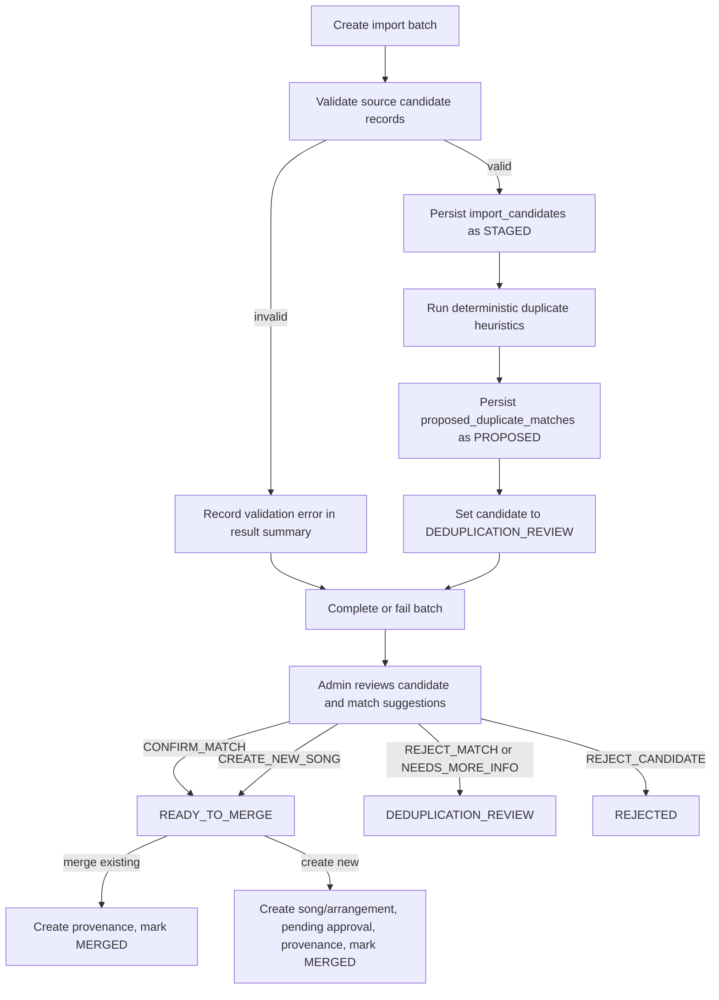

# Song Import and Deduplication Workflow

This document operationalizes
[ADR-003: Song Import and Deduplication Workflow](./adr/ADR-003-song-import-deduplication.md).
It is written for agents and maintainers who need to add safe import sources,
run fixture-driven tests, or review staged song candidates without weakening
Cadentia's core guardrails.

## Safety boundaries

- Import work is **staged**. Raw imported records are written to
  `import_candidates`, not directly to canonical `songs`, `arrangements`, or
  `lyrics_documents`.
- Deduplication is **deterministic and explainable**. The LLM must never decide
  whether two songs are the same song, and heuristic scores never authorize an
  automatic merge.
- Review work is **manual and auditable**. Reviewer identity, timestamp,
  decision, notes, and provenance must be persisted before a candidate can
  update canonical catalog records.
- Merge work is **not approval work**. Imported canonical songs and arrangements
  remain `IN_REVIEW` with pending approval records unless the separate ADR-005
  doctrinal approval workflow explicitly approves them.
- Fixture examples must use synthetic data. Do not place private provider
  credentials, proprietary catalog exports, or copyrighted lyrics in docs or
  tests.

## Implemented code and schema

| Area | Implementation |
| --- | --- |
| Schema | `apps/api/src/main/resources/db/migration/V003__import_candidate_deduplication_schema.sql` |
| Ingestion service | `apps/api/src/main/java/com/cadentia/scraperadmin/ImportBatchIngestionService.java` |
| Deterministic heuristics | `apps/api/src/main/java/com/cadentia/scraperadmin/DeterministicSongDeduper.java` |
| Review and merge service | `apps/api/src/main/java/com/cadentia/scraperadmin/AdminImportReviewService.java` |
| Ingestion command DTO | `apps/api/src/main/java/com/cadentia/scraperadmin/ImportBatchIngestionCommand.java` |
| Candidate record DTO | `apps/api/src/main/java/com/cadentia/scraperadmin/ImportCandidateRecord.java` |
| Merge command DTOs | `apps/api/src/main/java/com/cadentia/scraperadmin/MergeIntoExistingSongCommand.java`, `apps/api/src/main/java/com/cadentia/scraperadmin/CreateCanonicalSongFromImportCandidateCommand.java` |

There is no supported production import-source adapter, REST endpoint, or CLI
command documented as implemented at this time. Current repeatable execution is
through service tests and repository integration tests.

## End-to-end lifecycle



### Step 1: Create an import batch

`ImportBatchIngestionService.ingest(...)` creates an `import_batches` row with:

- `source_system` from the command, such as `fixture-csv` in tests.
- `initiated_by` from the command, such as `admin@example.test` in tests.
- initial status `RUNNING`.
- a JSON summary placeholder that is replaced when ingestion completes.

The service then snapshots current canonical catalog candidates for deterministic
comparison. Staged candidates are compared against these canonical rows, but no
canonical records are modified during ingestion.

### Step 2: Validate candidate shape

Each `ImportCandidateRecord` is validated before persistence. The implemented
validation requires:

- `rawTitle` to be present and normalizable.
- `sourceArtistMetadataJson` to parse as a JSON object.
- `sourcePayloadJson` to parse as a JSON object.

Invalid records are not silently dropped. The result includes an
`ImportCandidateValidationError` with a row identifier, field name, and message.
The batch summary records submitted, accepted, proposed-match, and validation
error counts.

### Step 3: Persist staged candidates

Accepted records are inserted into `import_candidates` with status `STAGED` and
with their complete source payload retained for audit. The stored data includes:

- import batch ID.
- optional external candidate ID.
- raw source title.
- normalized title.
- optional source artist display name and structured source artist metadata.
- optional CCLI number.
- optional allowed-source lyrics hash.
- complete source payload JSON.

These rows are not recommendable. Recommendation eligibility must come from
canonical catalog rows and the approval workflow, not from staged import data.

### Step 4: Apply deterministic deduplication heuristics

After each candidate is persisted, `DeterministicSongDeduper` returns zero or
more explainable duplicate suggestions. Suggestions are recorded in
`proposed_duplicate_matches` with status `PROPOSED`, a score between `0` and
`1`, and signal-level JSON explanations.

Implemented signals are:

| Signal | Meaning | Merge authority |
| --- | --- | --- |
| `ccliNumber` | Exact source-provided CCLI song number match when both sides have a value. | Strong evidence only; never an automatic merge. |
| `lyricsHash` | Exact hash match computed only from allowed source text. | Strong evidence only; never an automatic merge. |
| `normalizedTitle` | Exact or near token match after deterministic title normalization. | Supporting evidence only. |
| `artistSimilarity` | Deterministic artist-token similarity tier. | Supporting evidence only. |

A suggestion is returned when an exact identifier signal matches or when the
combined deterministic score reaches the implemented suggestion threshold. The
suggestion payload includes the individual signal explanations so reviewers can
understand why the candidate was surfaced.

### Why heuristics do not merge automatically

Heuristics are intentionally conservative assistants, not identity authorities.
Title variants, medleys, translations, live versions, public-domain hymn texts,
and missing metadata can all produce plausible false positives. Even exact CCLI
or lyrics-hash matches require human review because Cadentia must preserve:

- provenance clarity for the imported source.
- doctrinal and licensing review boundaries.
- curated canonical metadata.
- auditability of who accepted identity risk.

Therefore ingestion only creates `proposed_duplicate_matches`; it does not create
or update `songs`, `arrangements`, `lyrics_documents`, `approval_records`, or
recommendation read models.

### Step 5: Complete or fail the import batch

At the end of ingestion, the batch is updated with a JSON summary. The service
uses:

- `COMPLETED` when at least one candidate was accepted.
- `FAILED` when no candidates were accepted.

Validation errors can coexist with a `COMPLETED` batch if other rows were valid.
The summary remains the operational place to inspect row-level import failures.

### Step 6: Admin review

`AdminImportReviewService.recordReview(...)` records an
`import_candidate_reviews` row and updates operational status. The reviewer is
responsible for checking source payloads, provenance, licensing notes, and the
signal explanations before choosing a decision.

Reviewer responsibilities:

- Confirm that source payloads and artist metadata are sufficient for audit.
- Confirm that lyrics hashes were computed only from allowed source text before
  relying on a lyrics-hash signal.
- Compare candidate metadata with any proposed canonical song.
- Reject weak or ambiguous proposed matches rather than forcing a merge.
- Use `NEEDS_MORE_INFO` when source, licensing, authorship, or identity evidence
  is incomplete.
- Leave doctrinal approval to the ADR-005 workflow.

### Step 7: Merge reviewed candidates

A candidate can only be merged after a permitting review decision exists.
Supported merge operations are:

1. **Merge into an existing canonical song.** Requires a `CONFIRM_MATCH` review
   for the target proposed duplicate match. The merge writes provenance linking
   the target song back to the import candidate's batch and then marks the
   candidate `MERGED`.
2. **Create a new canonical song.** Requires a `CREATE_NEW_SONG` review. The
   merge creates or reuses the normalized-title/language song, creates or reuses
   a default imported arrangement, writes provenance records, creates a pending
   catalog-inclusion approval record, and marks the candidate `MERGED`.

Repeated merge requests for an already merged candidate are idempotent: the
service returns the existing merged song and does not duplicate canonical rows,
arrangements, provenance, or approval records.

## Status reference

### Import batch statuses

| Status | Meaning | Typical owner |
| --- | --- | --- |
| `PENDING` | Batch exists but processing has not begun. Reserved for future queued import flows. | Import orchestration |
| `RUNNING` | Batch is actively validating candidates, staging accepted rows, and recording proposed matches. | Ingestion service |
| `COMPLETED` | Ingestion finished with at least one accepted candidate. Review may still be pending. | Ingestion service |
| `FAILED` | Ingestion finished with no accepted candidates or cannot produce usable staged data. | Ingestion service |
| `CANCELLED` | Batch was intentionally stopped before completion. Reserved for future operational controls. | Import orchestration/admin |

### Import candidate statuses

| Status | Meaning | Allowed next steps |
| --- | --- | --- |
| `STAGED` | Raw candidate has been persisted but deduplication review has not yet been prepared. | Run heuristics and move to `DEDUPLICATION_REVIEW`. |
| `DEDUPLICATION_REVIEW` | Candidate is awaiting or continuing manual review of suggested matches and source evidence. | Record review decisions; request more info; reject; or permit merge. |
| `READY_TO_MERGE` | A reviewer has recorded `CONFIRM_MATCH` or `CREATE_NEW_SONG`. | Run merge into existing song or create-new canonical song. |
| `MERGED` | Candidate has been linked to a canonical song through an explicit merge operation. | No further merge work; repeated merge requests should be idempotent. |
| `REJECTED` | Reviewer rejected the imported candidate as unsuitable for catalog ingestion. | Keep audit trail; do not merge. |
| `FAILED` | Candidate processing failed before review could safely continue. | Investigate failure; do not merge unless remediated through a future controlled process. |

### Proposed duplicate match statuses

| Status | Meaning |
| --- | --- |
| `PROPOSED` | Deterministic heuristics suggested the candidate may duplicate a canonical song. |
| `REVIEWED` | A reviewer recorded a decision against this proposed match. |
| `SUPERSEDED` | Suggestion was replaced or invalidated by a later review or future rerun. Reserved for future flows. |

### Review decisions

| Decision | Candidate status after review | Meaning |
| --- | --- | --- |
| `CONFIRM_MATCH` | `READY_TO_MERGE` | Reviewer agrees the candidate is the same song as a proposed canonical match. |
| `REJECT_MATCH` | `DEDUPLICATION_REVIEW` | Reviewer rejects a specific proposed duplicate match; other suggestions or create-new review may still be considered. |
| `CREATE_NEW_SONG` | `READY_TO_MERGE` | Reviewer decides the candidate should become a new canonical song rather than merge into an existing song. |
| `REJECT_CANDIDATE` | `REJECTED` | Reviewer rejects the candidate from catalog ingestion. |
| `NEEDS_MORE_INFO` | `DEDUPLICATION_REVIEW` | Reviewer cannot safely decide until missing source, licensing, authorship, or identity evidence is resolved. |

## Failure handling

| Failure | Handling |
| --- | --- |
| Missing or blank required command fields | Command DTO constructors throw validation exceptions before work starts. |
| Missing `rawTitle` | Candidate is rejected from persistence and returned as a validation error. |
| Non-object source artist metadata JSON | Candidate is rejected from persistence and returned as a validation error. |
| Non-object source payload JSON | Candidate is rejected from persistence and returned as a validation error. |
| Title cannot be normalized | Candidate is rejected from persistence and returned as a validation error. |
| No duplicate suggestions | Candidate still moves to `DEDUPLICATION_REVIEW`; reviewer may choose `CREATE_NEW_SONG`, `REJECT_CANDIDATE`, or `NEEDS_MORE_INFO`. |
| Proposed match references another candidate | Review service rejects the command because match ownership must agree with the candidate under review. |
| Merge without a permitting review | Merge service rejects the operation. |
| Already merged candidate | Merge service treats the request as an idempotent replay and avoids duplicate writes. |

Operational investigations should start with the import batch summary, then the
candidate's source payload, proposed match signal JSON, review records, and
provenance records produced by any merge.

## Fixture-driven examples

The examples below are synthetic and are suitable for documentation or tests.
They are not production catalog data and should not be treated as approved songs.

### Ingestion command example

```java
ImportBatchIngestionResult result = importBatchIngestionService.ingest(
        new ImportBatchIngestionCommand(
                "fixture-csv",
                "admin@example.test",
                List.of(new ImportCandidateRecord(
                        "row-1",
                        "fixture-source-1",
                        "Great Is Thy Faithfulness (Live)",
                        "Fixture Artist",
                        "{\"sourceArtistId\":\"fixture-artist-1\"}",
                        "18723",
                        null,
                        "{\"title\":\"Great Is Thy Faithfulness (Live)\"}"))));
```

Expected behavior when a matching synthetic catalog song exists:

- one `import_batches` row starts as `RUNNING` and ends as `COMPLETED`.
- one `import_candidates` row is stored with normalized title
  `great-is-thy-faithfulness`.
- one or more `proposed_duplicate_matches` rows may be stored with deterministic
  signal explanations.
- no canonical song is updated during ingestion.

### Review and merge-existing example

```java
adminImportReviewService.recordReview(new CreateImportCandidateReviewCommand(
        candidateId,
        proposedDuplicateMatchId,
        ImportCandidateReviewDecision.CONFIRM_MATCH,
        "reviewer@example.test",
        "Synthetic fixture match confirmed for test coverage."));

AdminMergeResult mergeResult = adminImportReviewService.mergeIntoExistingSong(
        new MergeIntoExistingSongCommand(
                candidateId,
                targetSongId,
                "reviewer@example.test",
                "fixture-csv",
                null,
                "Fixture CSV row 1",
                LicenseType.UNKNOWN,
                "Synthetic fixture only.",
                ImportMethod.CSV_IMPORT));
```

Expected behavior:

- the review row records the reviewer and decision.
- the proposed match moves to `REVIEWED`.
- the candidate moves to `READY_TO_MERGE`, then `MERGED` after the merge.
- a provenance record links the target song to the import batch.
- no approval is granted implicitly.

### Review and create-new example

```java
adminImportReviewService.recordReview(new CreateImportCandidateReviewCommand(
        candidateId,
        null,
        ImportCandidateReviewDecision.CREATE_NEW_SONG,
        "reviewer@example.test",
        "No safe duplicate match in the synthetic fixture catalog."));

AdminMergeResult mergeResult = adminImportReviewService.createNewCanonicalSong(
        new CreateCanonicalSongFromImportCandidateCommand(
                candidateId,
                "reviewer@example.test",
                "New Fixture Song",
                "en",
                "Fixture Artist",
                "Fixture Writer",
                null,
                2026,
                "Synthetic fixture; doctrinal approval still pending.",
                null,
                "fixture-csv",
                null,
                "Fixture CSV row 2",
                LicenseType.UNKNOWN,
                "Synthetic fixture only.",
                ImportMethod.CSV_IMPORT));
```

Expected behavior:

- a canonical song is created or reused by normalized title and language.
- the song remains `IN_REVIEW`.
- a default imported arrangement is created or reused.
- provenance records link the song and arrangement to the import batch.
- a catalog-inclusion approval record is created with status `PENDING`.

## Local verification commands

Run the ADR-003-focused tests:

```bash
mvn -pl apps/api -Dtest=DeterministicSongDeduperTest,ImportBatchIngestionServiceTest,AdminImportReviewServiceTest test
```

Run the schema-focused test for import staging tables:

```bash
mvn -pl apps/api -Dtest=ImportCandidateSchemaTest test
```

Run the broader API module test suite before merging changes that touch import
workflow code:

```bash
mvn -pl apps/api test
```

Flyway applies `V003__import_candidate_deduplication_schema.sql` automatically
as part of the API test context and local application startup.
